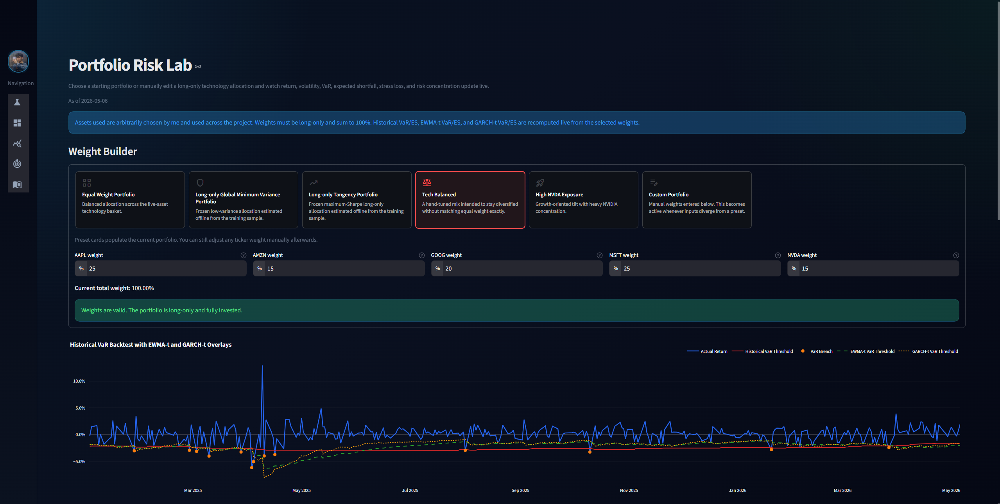

# Market Risk Engine

Interactive Streamlit dashboard for exploring portfolio construction, tail-risk measurement, model backtesting, stress testing, and risk attribution for a five-asset technology basket:

- `AAPL`
- `AMZN`
- `GOOG`
- `MSFT`
- `NVDA`

The app combines precomputed research outputs with a live custom-portfolio lab. Users can choose a preset allocation or type their own weights and immediately recompute portfolio returns, Historical VaR/ES, EWMA-t VaR/ES, and GARCH-t VaR/ES.

## What the app includes

- Hover-expand sidebar navigation styled through `style.css`
- Portfolio Risk Lab with live custom weights and a dedicated `Custom Portfolio` state
- Fixed portfolio presets:
  - Equal Weight Portfolio
  - Long-only Global Minimum Variance Portfolio
  - Long-only Tangency Portfolio
  - Tech Balanced
  - High NVDA Exposure
- Risk Models & Backtesting page for fixed-portfolio historical, EWMA-t, and GARCH-t comparisons
- Stress & Attribution page for scenario losses, covariance-based risk contribution, and drawdown attribution
- Methodology page with internal links to the corresponding app sections

## Portfolio Risk Lab behavior

- The app resets to `Equal Weight Portfolio` whenever the user enters the Portfolio Risk Lab page.
- If the user manually changes any weight so it no longer matches the currently selected preset, the card selection switches to `Custom Portfolio`.
- Live metrics update once the portfolio is valid, long-only, and sums to `100%`.
- The snapshot shows:
  - Historical VaR
  - Historical ES
  - EWMA-t VaR
  - EWMA-t ES
  - Worst Stress Scenario
  - Highest Risk Contributor
  - Maximum Drawdown
  - Worst Stress Loss
  - Sharpe Ratio
  - Backtest Cumulative Return
  - Backtest CAGR
  - Annualized Volatility

## Data and modeling notes

- Fixed portfolios were estimated on a training window from `2016-01-01` to `2025-01-01`.
- The portfolio backtest window begins on `2025-01-01`.
- Historical VaR/ES uses a `95%` confidence level and a `252`-day rolling window.
- EWMA-t uses exponentially weighted volatility with Student-t tails.
- GARCH-t is refit live for the custom portfolio inside the dashboard and is also available in the fixed-portfolio comparison outputs.

## Repository layout

```text
market_risk/
|-- app.py
|-- style.css
|-- requirements.txt
|-- data/
|-- figure/
|-- additional_materials/
|-- scripts/
|   |-- 01_get_historical_data.py
|   |-- 02_historical_study.py
|   |-- 03_portfolio_study.py
|   |-- 04A_portfolio_construction.py
|   |-- 04B_market_risk_engine.py
|   |-- 04C_risk_engine_visualizations.py
|   |-- 04D_var_backtesting_tests.py
|   |-- 05A_ewma_t_var_es.py
|   |-- 05B_garch_t_var_es.py
|   |-- 05C_volatility_model_comparison.py
|   |-- 06_stress_testing.py
|   |-- 07_risk_attribution.py
|   |-- dashboard_utils.py
|   |-- risk_engine_utils.py
|   `-- path_utils.py
`-- README.md
```

## Install and run

### PowerShell

```powershell
python -m venv .venv
.\.venv\Scripts\Activate.ps1
pip install -r requirements.txt
streamlit run app.py
```

If you already have the virtual environment set up, this is enough:

```powershell
.\.venv\Scripts\streamlit.exe run app.py
```

## Regenerating the research pipeline

If you want to refresh the stored outputs under `figure/`, run the scripts in numerical order:

1. `01_get_historical_data.py`
2. `02_historical_study.py`
3. `03_portfolio_study.py`
4. `04A_portfolio_construction.py`
5. `04B_market_risk_engine.py`
6. `04C_risk_engine_visualizations.py`
7. `04D_var_backtesting_tests.py`
8. `05A_ewma_t_var_es.py`
9. `05B_garch_t_var_es.py`
10. `05C_volatility_model_comparison.py`
11. `06_stress_testing.py`
12. `07_risk_attribution.py`

## Dependencies

Main packages used by the project:

- `streamlit`
- `streamlit-extras`
- `streamlit-on-hover-tabs`
- `plotly`
- `pandas`
- `numpy`
- `scipy`
- `arch`
- `pyarrow`
- `yfinance`

## Notes

- `style.css` is required for the hover-tab sidebar behavior.
- The dashboard mixes precomputed outputs for fixed portfolios with live calculations for the custom portfolio.
- The repository link surfaced inside the app points to the broader market-risk-engine project folder in the parent GitHub repository.
